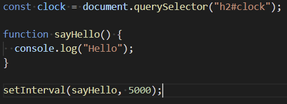

# 220115 - 바닐라 JS

#### setInterval()

특정한 함수를 일정한 간격을 두고 실행하고 싶을 때 쓰는 함수

setInterval()은 두가지 argument를 받는다. 

setInterval(실행할 함수, 호출되는 function 간격을 몇 ms로 할지 적어주면 됨)



=> 매 5초마다 sayHello라는 함수가 실행 됨.


#### setTimeout()

특정한 함수를 특정한 시간 뒤에 (한 번)실행하고 싶을 때 쓰는 함수

setInterval과 마찬가지로 두가지 argument를 받는다.

setInterval(실행할 함수, 함수를 몇 초 뒤에 부를지 숫자로 적어 주면 됨.)


=> 5초 뒤에 sayHello라는 함수가 실행됨


#### padStart(), padEnd()

string에 쓸 수 있는 함수들.

ex) 

"1".padStart(2, "0") => 앞의 "1"이라는 글자의 길이가 2가 아니라면, **앞**에 "0"이라는 글자를 추가하라. 출력은 "01"이 된다.

"1".padEnd(2, "0") => 앞의 "1"이라는 글자의 길이가 2가 아니라면, **뒤**에 "0"이라는 글자를 추가하라. 출력은 "10"이 된다.


#### 시계 표현


=> new Date()는 number라서 padStart()를 사용할 때, String으로 감싸서 문자로 바꿔주면 된다. getClock()을 setInterval()보다 먼저 실행함으로써 브라우저를 들어가자마자 실행하게 만들어 준다.


#### 소숫점 아래 없애기

1) round() :  숫자 반올림하기

2) ceil() : 숫자 무조건 올림하기

3) floor() : 숫자 무조건 내림하기 

0~9까지 랜덤한 숫자를 얻기위한 코드

```javascript
const images = ["0.jpeg", "1.jpeg", "2.jpeg", "3.jpg", "4.jpg", "5.jpg", "6.jpg", "7.jpg", "8.jpg", "9.jpg"];

const chosenImage = images[Math.floor(Math.random() * images.length)];
```


#### createElement()

javascript에서 html요소를 추가할 때 쓰임. 괄호안에는 추가하고 싶은 html tag를 넣으면 된다. 다음과 같이 쓸 수 있음.

```javascript
const bgImage = document.createElement("img");
bgImage.src = `img/${chosenImage}`;
```

실제 index.html 파일에는 안보이지만 브라우저에서 확인해보면 가 추가된 것을 확인 할 수 있다. 물론 7.jpg는 새로고침 할 때마다 다른 파일로 바뀐다.

하지만 실제 html에는 적용이 안되어서 사진은 아직 보이지 않는다.

```javascript
const bgImage = document.createElement("img");
bgImage.src = `img/${chosenImage}`;
document.body.appendChild(bgImage);
```

마지막 줄과 같이 body에 appendChild()함수로 추가해 주면 끝!!


#### JSON.stringify()

javascript의 object나 array 등 어떤 것도 string으로 바꿔주는 기능


#### localStorage에서 데이터를 받아와서 javascript에서 쓸 수 있는 살아있는 데이터로 바꿔줄 때


첫번째 줄이 localStorage에서 데이터를 받아오는 방법(그냥 string)

두번째 줄이 사용가능한 데이터로 받아오는 방법(array)


#### forEach()

배열에서 각 각의 데이터에 대해서 괄호안의 적혀진 함수를 실행하고 싶을 때 쓰는 함수


=> parsedTodos라는 array에 저장되어 있는 각각의 item에 sayHello라는 함수를 실행한다.

a, b, c라는 todo를 입력했을 때, 콘솔에서 볼 수 있는 출력값

