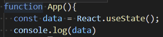
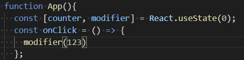

# 220119

#### React JS에서 데이터를 저장시켜 자동으로 리렌더링을 일으킬 수 있는 방법



함수안에서 const data = React.useState();를 콘솔에서 확인하면 아래와 같이 undefined와 함수가 적힌 배열이 나온다.


undefined(0)는 data이고, 옆에 있는 함수(1)는 data를 바꿀 때 사용하는 함수이다. 



위의 그림처럼 바꿔줌으로써, 숫자형 data는 counter로, data를 바꿀 때 사용하는 함수는 modifier로 지정해준다.(counter나 modifier로 지정한 변수명은 무엇이든 상관없음)

그런 다음 onClick이라는 함수를 만들어주고 modifier()함수를 넣어주면 괄호안에 어떤 값(위의 예시에는 123)을 가지고 있던 간에 그 값으로 업데이트 해주고 리렌더링 해준다. **modifier 함수내에서 업데이트와 리렌더링이 자동으로 이루어진다.**


#### 배열 이용하기

```react
const x = [1, 2, 3]
const [a, b, c] = x;
```

=> 결과적으로 a=1, b=2, c=3이 된다.


