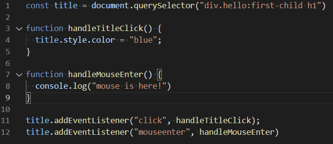

# 220112 - 바닐라 JS

- javascript는 이미 우리가 만든 html과 연결되어 있다. 

- 콘솔에서 document로 접근가능 (document.tiltle, document.body 등..)

  => document는 우리가 javascript에서 html에 연결할 수 있는 방법

  (**document는 javascript관점에서의 html을 뜻한다.**)


#### getElementById(string)

()안의 string을 id로 가진 element를 가져오는 함수

```javascript
const title = document.getElementById("title")
console.log(title)
```

콘솔에서 보여지는 결과는 다음과 같다.


> Uncaught TypeError : Cannot set property 'innerText' of ~ null
>
> => 흔히 볼 수 있는 에러. null(아무것도 없는)값을 가지고 있는 것의 innerText에 접근해 바꾸려고 하니 에러가 생긴 경우


```javascript
<body>
	<div class="hello">
		<h1>Grab me!</h1>
	</div>
</body>
```

#### getElementsByTagName()

()안에 태그의 이름을 적어서 불러온다.

```javascript
const title = document.getElementByTagName("h1");
console.log(title)
```

=> HTMLCollection [h1]으로 콘솔에 출력됨

#### querySelector()

element를 css방식으로 검색할 수 있음. 같은 조건을 가진 여러가지 element가 있어도 단 하나, 첫번째의 element를 return해줌

```javascript
const title = document.querySelector(".hello h1");
const title = document.querySelector(".hello h1:first-child");
```

=> hello라는 이름을 가진 클래스 그 안에 있는 h1을 불러오라는 말임.

=> first-child, second-child 등으로 지정해줄 수 있음.

#### querySelectorAll()

querySelector()는 하나만 불러오지만 querySelectorAll()은 조건이 같은 모든 element를 불러온다.


### Event

=> (기본 로직) element를 찾아서 event listener를 추가하고, event가 발생하면 반응한다.



addEventLister()를 사용해서 특정 element에 대한 event를 만들 수 있음.


위의 두 줄은 같은 의미를 가지고 있음


** body나 head, title(head안에 있는 title)은 아주 중요한 element여서 콘솔에서document로 불러올 수 있지만 다른 element(h1, div 등..)은 document를 통해서 불러올 수 없다.

### Window

window에 쓸 수 있는 이벤트도 있음. 

```javascript
function handleWindowCopy() {
  alert("copier!");
}
window.addEventListener("copy", handleWindowCopy);
```

EX) 와이파이가 연결되었는지 아닌지 알려주는 event

```javascript
function handleWindowOffline(){
  alert("SOS! no WIFI!");
}
function handleWindowInline() {
  alert("ALL GOOD!")
}

window.addEventListener("offline", handleWindowOffline);
window.addEventListener("inline", handleWindowInline);
```

https://developer.mozilla.org/en-US/docs/Web/API/Window 참고


### IF-ELSE

```javascript
// javascript와 css를 같이 쓴 것. 파일을 분리해놓는 게 좋음.
const h1 = document.querySelector("div.hello:first-child h1");

function handleTitleClick() {
  const currentColor = h1.style.color;
  if (currentColor === "blue") {
    currentColor = "tomato";
  } else {
    currentColor = "blue";
  }
}
h1.addEventListener("click", handleTitleClick)
```

```javascript
const h1 = document.querySelector("div.hello:first-child h1");

function handleTitleClick() {
  const clickedClass = "clicked";
  if (h1.className === clickedClass) {
    h1.className = "";
  } else {
    h1.className = clickedClass;
  }
}
```

class의 이름(clicked)를 변수(clickedClass)에 저장하는 것을 매우 중요. 변수를 잘 못 쓰게 되면 콘솔창에 오류가 뜨지만 class의 이름을 변수에 저장하지 않고 그냥 쓰면 잘 못 써도 뭐가 틀렸는지 알 수가 없음.

```javascript
const h1 = document.querySelector("div.hello:first-child h1");

function handleTitleClick() {
  const clickedClass = "clicked";
  if (h1.classList.contains(clickedClass)) {
    h1.classList.remove(clickedClass);
  } else {
    h1.classList.add(clickedClass);
  }
}
```

여러 클래스 목록 중에 선택할 때는 classList.contains, 없앨 때 classList.remove, 추가할 때 classList.add를 사용하면 된다.

위의 코드는 아주 흔하게 사용되는 거라 빼고 추가하고를 쉽게 해줄 수 있는 것이 존재함

#### toggle

```javascript
const h1 = document.querySelector("div.hello:first-child h1");

function handleTitleClick() {
  h1.classList.toggle("clicked");
}

h1.addEventListener("click", handleTitleClick);
```

