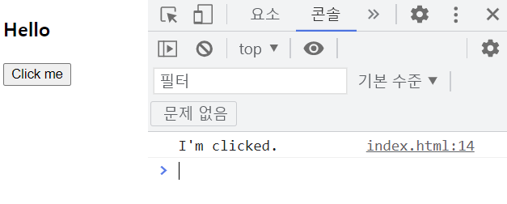
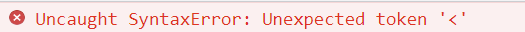
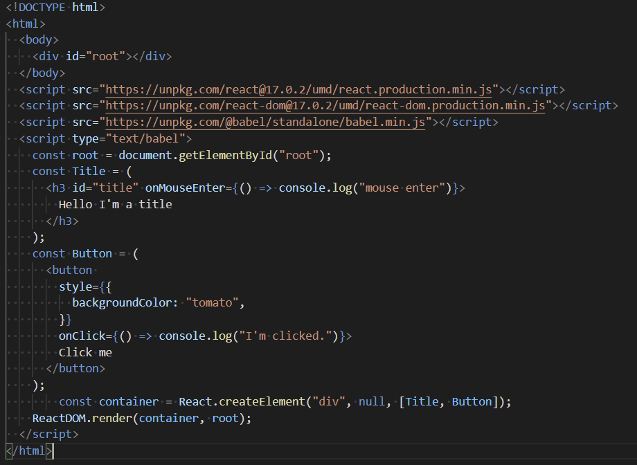
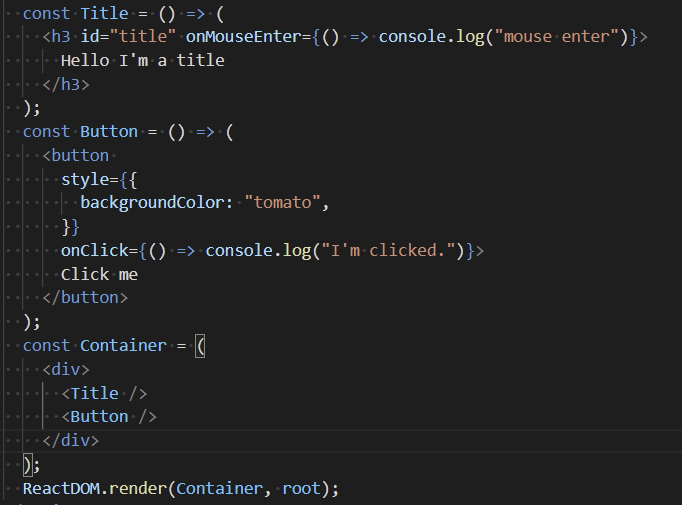

# 220117

React를 시작하기에 앞서 React와 React-dom을 html파일에 import해줘야 한다.

```html
<script src="https://unpkg.com/react@17.0.2/umd/react.production.min.js"></script> 
// interactive한 UI를 만들 수 있게 해줌
  <script src="https://unpkg.com/react-dom@17.0.2/umd/react-dom.production.min.js"></script> 
// React element를 html에 두는 역할
```

html에 직접 element를 작성하지 않고, javascript와 React JS를 이용해서 element 생성


#### Element 만들기

### (createElement() => 어려운 방법, 잘 쓰지 않음)

```react
const h3 = React.createElement("h3", null, "Hello");
```

=> property는 없고, "Hello"라는 텍스트를 가지고 있는 h3 tag를 만들어줌.

```react
const btn = React.createElement(
      "button", 
      {
      onClick: () => console.log("I'm clicked."),
      }, 
      "Click me"
      );
```

Click했을 때 실행되는 함수(onClick)를 적어주고, "Click me"라는 텍스트를 가지고 있는 button을 만들어줌.



**javascript의 함수 형태와는 다르게 앞에 on을 붙여줘야 React에게 event listener를 생성한다고 알려줄 수 있음.**


#### render()

ReactDOM.render(container, root);

React element(container)들을 root div안에서 보여주라는 뜻


### Element 만들기(쉬운 방법, JSX 이용)

```react
// JSX로 적은 코드
const Button = (
      <button 
        style={{
          backgroundColor: "tomato",
        }}
        onClick={() => console.log("I'm clicked.")}>
        Click me
      </button>
    );
```

위의 코드랑 같은 것을 달리 표현했고, 앞으로 위와 같은 코드를 쓸 것이다. 하지만 html에 위와 같이 쓴다고 바로 적용되지 않는다. 

브라우저에서 보면 다음과 같은 에러가 뜨는데 이는 브라우저가 JSX로 적은 코드를 이해할 수 없기 때문이다.



따라서, Babel 변환기를 설치해줘야 하는데 babel/standalone을 이용하면 된다. html에 다음의 두줄을 넣어주면 끝!!

```react
<script src="https://unpkg.com/@babel/standalone/babel.min.js"></script>
<script type="text/babel">
```

더 좋은 방법들이 존재하긴 함(위에 두줄을 입력하는 방식은 느리기 때문)




**html요소가 아니라 직접 만든 요소라면 반드시 맨 첫글자는 대문자로 적어주어야 한다. 그래야 JSX로 적어주었다는 것을 알 수 있음.**



Title과 Button을 함께 렌더링하고 싶을 때는 Title과 Button을 함수로 만들어 주고(arrow 함수 이용) Container를 만들어 안에 html 태그처럼 넣어준다. 

같은 기능을 여러번 넣고 싶을 때는 함수로 정의했기때문에  container안에 태그만 여러번 넣어주면 동일한 코드로 재사용 가능하다.