# 220122

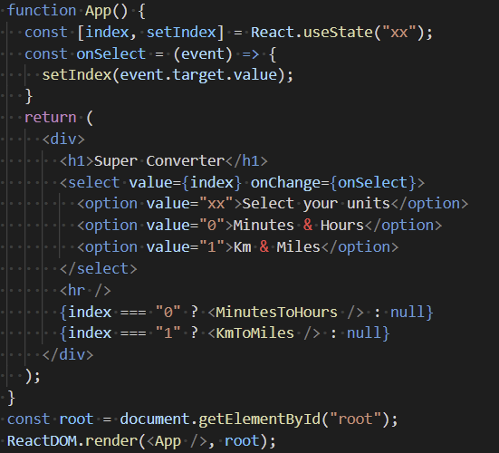

=> 드롭다운으로 선택할 수 있게 만들어서 한번에 다 보여지는 게 아니라 원하는 컴포넌트만 보이게 만들어주었다.

#### props

> 부모 컴포넌트로부터 자식 컴포넌트에 데이터를 보낼 수 있게 해주는 방법


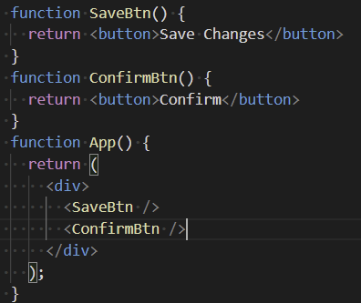

SaveBtn()과 ConfirmBtn()은 함수형 컴포넌트이고, function App의 div를 JSX의 내부라고 부른다. 


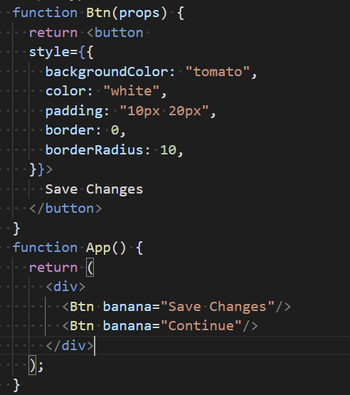

우리가 여기서(App) 하는 것은 Btn이라는 이름의 함수를 부르고 있는 것 뿐이다.

그리고 우리가 넣어둔 모든 것들(props를 말하고, 예를 들면 banana="Save Change"같은)을 오브젝트에 첫 번째 인자로서 넣어준다. Btn({banana: "Save Changes"}) 와 같음

props는 첫 번째이자 유일한 인자이다. Btn함수가 전달 받는 유일한 인자!

props는 오브젝트이다.  우리가 App의 Btn을 통해서 전달한 모든 것들(banana="Save Change")을 갇는 오브젝트


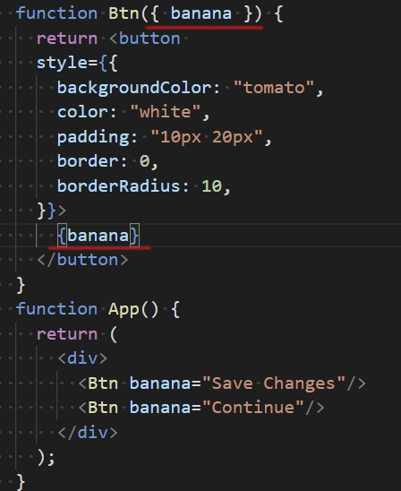

위의 사진에서 밑줄 쳐진 것처럼 props는 오브젝트 그 자체이기 때문에 shortcut으로 banana를 대신 쓸 수 있고, 내용 또한 banana 인자(2번째 밑줄)를 넣어서 버튼마다 다르게 설정할 수 있다.

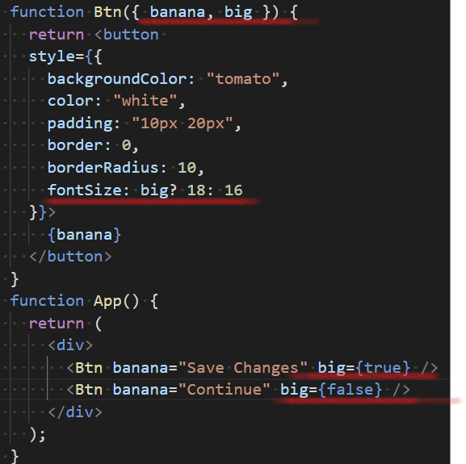

위와 같이도 활용가능 Btn에 big이라는 인자를 넣어주고 true인것은 18px로 false인 것은 16px로 지정해준다.


onClick을 html 요소에다가 넣어주면 EventListner가 맞지만, 커스텀 컴포넌트에다가 넣으면 그냥 prop이다. onClick이라는 이름을 가진 prop


우리는 prop이 변경되지 않으면 다시 리렌더링 할지 말지를 결정할 수 있다.

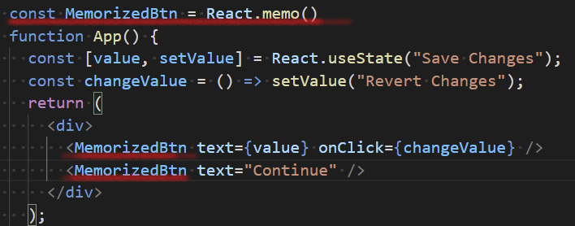

위와 같이 React.memo()를 이용하면 리렌더링 할 때 마다 prop이 바뀌지 않으면 그 prop은 렌더링 하지 않는다. 내용이 바뀌는 것만 리렌더링 함. 지금은 당장 쓰지 않을지도 모르나 나중에 하나의 함수에 엄청 많은 내용이 들어있으면 위와 같이 React.memo()를 써서 속도를 최적화시켜야 한다. 


#### create-react-app

맨 처음 시작할 때 create-react-app을 설치하면 훨씬 쉽게 react를 시작할 수 있다.

```
npx create-react-app (생성할 app 이름)
cd 생성한 app 이름
npm start
```

위와 같이 진행하면 브라우저가 뜨고 리액트 로고가 회전하고 있는 것을 볼 수 있다.

그럼 성공!!

src는 우리가 만들 모든 파일이 들어있어야 한다. 니콜라스 강의에서는 App.js와 index.js말고는 다 지웠다!

> index.js 파일

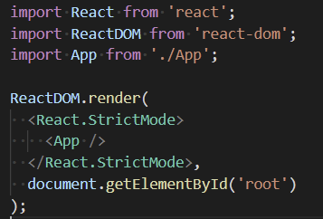

> App.js 파일

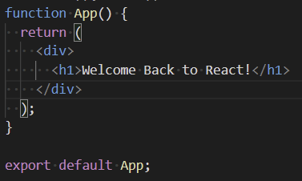


css를 적용하는 방법은 여러가지가 있지만 가장 좋은 것은 css도 모듈화 하는 것!

예를 들어, Button.js라는 파일에 있는 button의 스타일을 적용해주고 싶을 때, Button.module.css라는 파일을 만들어 클래스로 만들어진 버튼을 꾸며준다.

> Button.module.css

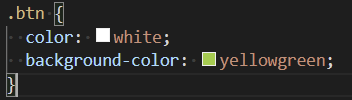

> Button.js

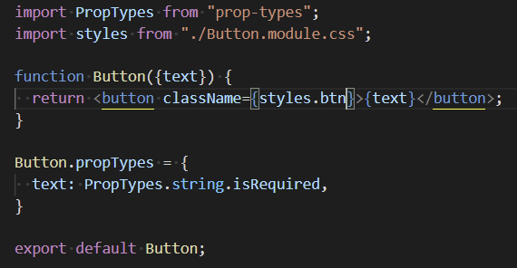

create-react-app은 css코드를 javascript 오브젝트(styles)로 변환시켜준다. 그리고 javascript 오브젝트 즉, styles 안에 btn이 있어서 이걸 쓰려면 아래의 코드처럼 쓰면 된다. 물론 동일한 class이름 예를 들면 btn을 다른 파일 내에서도 쓰일 수 있다. (콘솔로 확인 했을 때, create-react-app이 랜덤한 클래스명으로 설정하기 때문에 가능.)

```react
<button className={styles.btn}></button>
```


```react
const [counter, setValue] = useState(0);
```

React app으로 진행중이라 React.useState(0);라고 안 써도 됨. 그냥 useState(0) !!


#### useEffect()

useState를 사용할 경우 state가 변경될 때 마다, 예를 들어 button을 누르면 매번 렌더링 되는데 어떤 코드는 처음에만 렌더링하고 그 후로는 렌더링 하고 싶지 않을 때가 있다. 

예를 들어, API 호출 할 경우! 그럴 때, useEffect()를 쓰면 된다

useEffect()는 코드가 **딱 한번만** 실행될 수 있도록 보호해준다. 

useEffect는 두가지 인자를 받는데 첫번째 인자에는 실행되지 않았으면 하는 함수를 넣어주고, 두번째 인자는 React에서 주시할 것을 입력해주고 그것이 변화할 때만 실행하라는 의미이다.

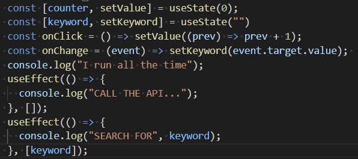

위의 그림처럼 첫번째 useEffect에는 빈 배열이 놓여져 있다. 이 배열의 의미는 계속 지켜봐야 할 것이 없다는 것이고, 이는 딱 한번만 실행이 된다는 뜻이다. 

두번째 useEffect에는 keyword가 들어가 있다. 이는 State에 저장되어 있는 keyword가 변화할 때 마다 실행을 하라는 의미이다. (const [keyword, setKeyword] = useState(0); 여기서의 keyword!!)