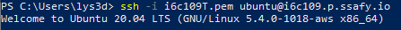
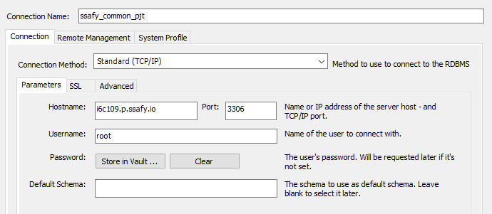

## 01.24 (월)

### 아키텍처 및 DB설계

MSA 구조에 맞춰 auth서버, camp서버, chat서버에 따라 각 서버별로 DB를 두어 설계하였고, 예외로 세션 DB를 이용하여 토근을 관리 할 수 있도록 설계 했다.

이후 컨설턴트 님에게 확인을 받고, 자주 사용되는 데이터와 비교적 사용 빈도수가 적은 데이터를 분리하는 정규화 작업을 진행하였다.


## 01.25 (화)

### 시퀀스 다이어그램 제작

기능을 이해하기 편하도록 각 서버에서 수행하는 기능별로 시퀀스 다이어그램을 만들었다.

**시퀀스 다이어그램의 장점**

- 시퀀스 다이어그램을 이용하면 API 등의 유즈케이스를 디테일하게 알 수 있다.
- 메서드 콜, DB 조회, 타 시스템의 API 호출등 로직을 모델링할 수 있기 때문에 **시나리오를 파악하기** 좋다.


## 01.26 (수)

### 서버접속 이해

#### SSH란?

SSH란 Secure Shell Protocol, 즉 네트워크 프로토콜 중 하나로 컴퓨터와 컴퓨터가 인터넷과 같은 Public Network를 통해 서로 통신을 할 때 보안적으로 안전하게 통신을 하기 위해 사용하는 프로토콜이다

대표적인 사용의 예

1. 데이터 전송
   - 원격 저장소인 깃헙
   - 소스 코드를 원격 저장소인 깃헙에 푸쉬할 때 SSH를 활용해 파일을 전송
2. 원격 제어
   - AWS의 인스턴스 서버에 접속하여 해당 머신에 명령을 내리기 위해 SSH를 통한 접속


#### FTP와 Telnet과 같은 프로토콜을 사용하지 않고 SSH를 쓰는 이유

- 위에 언급한 두 프로토콜을 통해 민감한 정보(예를 들어 로그인 정보)를 주고받는다면 정보를 직접 네트워크를 통해 넘기기 때문에 누구나 해당 정보를 열어볼 수 있어 보안에 취약하다.

- SSH는 먼저 안전한 채널을 구성한 뒤 정보를 교환하기 때문에 보다 보안적인 면에서 훨씬 뛰어나다.

  

#### SSH가 보안적으로 뛰어난 이유(Public Key, Private Key)

SSH는 한 쌍의 Key를 통해 접속하려는 컴퓨터와 인증 과정을 거치게 된다.

이 한 쌍의 Key는 다음과 같다.

- **Public Key**
  - 공개되어도 비교적 안전한 Key를 뜻함
  - Public Key를 통해 메시지를 전송하기 전 암호화
  - 암호화는 가능하지만 복호화는 불가능
- **Private Key**
  - 절대로 외부에 노출이 되어서는 안되는 Key로 본인의 컴퓨터 내부에 저장
  - Private Key를 통해 암호화된 메시지를 복호화

이렇게 한 쌍의 **Public Key**와 **Private Key**는 서로 매우 복잡한 수학적인 관계를 맺고 있다.

Public Key와 Private Key를 통해 다른 컴퓨터와 통신을 하기 위해서는 먼저 Public Key를 통신하고자 하는 컴퓨터에 복사하여 저장한다. 그리고 요청을 보내는 클라이언트 사이드 컴퓨터에서 접속 요청을 할 때 응답을 하는 서버 사이드 컴퓨터에 복사되어 저장된 Public Key와 클라이언트 사이드에 해당 Public Key와 쌍을 이루는 Private Key와 비교를 하여 서로 한 쌍의 Key인지 아닌지를 검사한다.

이렇게 서로 관계를 맺고 있는 Key라는 것이 증명이 되면 두 컴퓨터 사이에 암호화된 채널이 형성이 되어 Key를 활용해 메시지를 암호화하고 복호화하며 데이터를 주고 받을 수 있게 된다.


## 01.27 (목)

### 개발환경 세팅

#### 서버 접속 방법

pem key를 이용하여 ec2-ubuntu 서버에 접속



```
ssh -i i6c109T.pem ubuntu@i6c109.p.ssafy.io
```


#### 서버 설정 후 DB 설치

#### Workbench 접속




현재진행상황

- DB를 여러개로 나눠야 하는데, 스키마를 세 개로 나눌 것인지, 포트를 다르게 둘 것인지, 서버를 다르게 둘 것인지 고민 중

- 공공데이터를 데이터구조에 맞게 저장하는 중